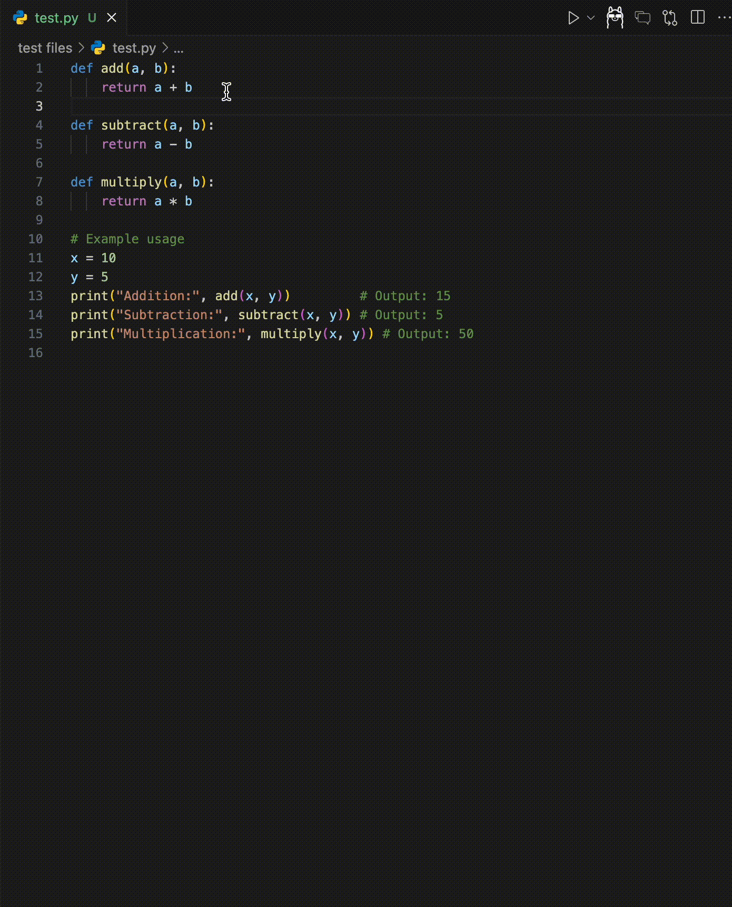
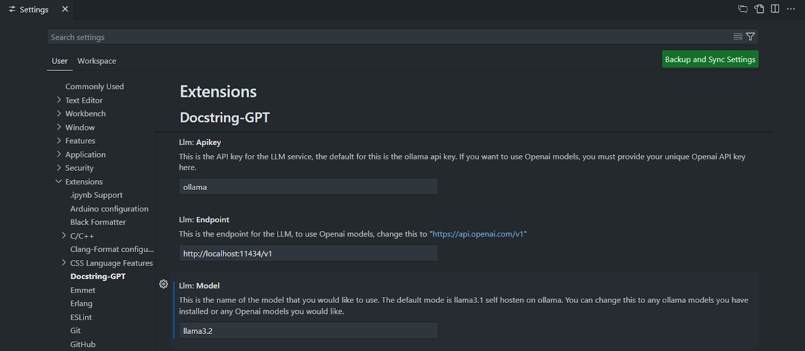
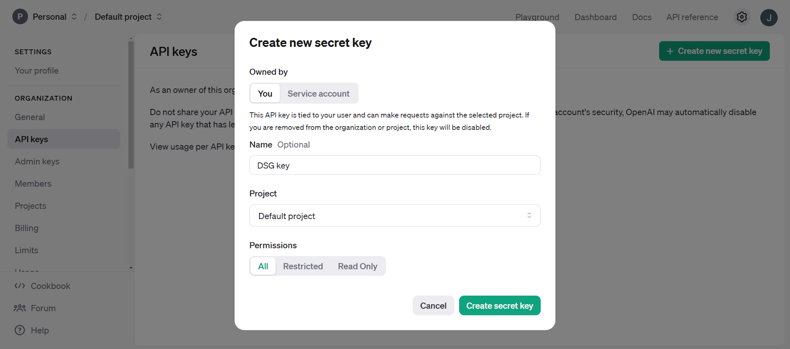
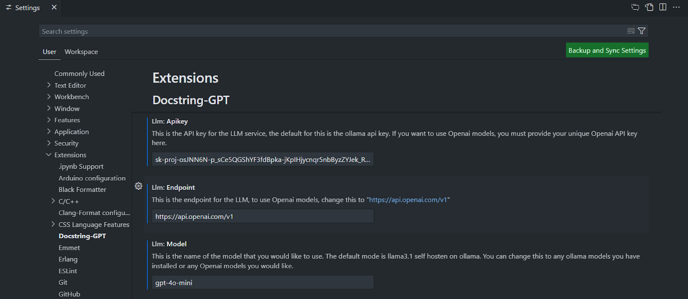

# DSG

DSG is a VSCode extension that helps programmers generate useful and consistent docstrings for functions and classes in any codebase. By leveraging large language models from OpenAI or those supported by Ollama, the extension automates and standardizes the process of writing docstrings. This tool aims to improve documentation quality, reduce manual effort, and improve code maintainability. 

## Features

**Generate docstring**: Automatically generate docstrings for Python, JavaScript, Java, C/C++, Typescript, and React.

**Regenerate docstrings**: Regenerate docstrings for supported languages.

**Customizable models**: Choose between OpenAI and Llama-based models for docstring generation.

**Style options**: Select from various docstring styles such as Google, Javadoc, and more.

<!-- Describe specific features of your extension including screenshots of your extension in action. Image paths are relative to this README file. -->

<!-- For example if there is an image subfolder under your extension project workspace:

\!\[feature X\]\(images/feature-x.png\)

> Tip: Many popular extensions utilize animations. This is an excellent way to show off your extension! We recommend short, focused animations that are easy to follow. -->

## Requirements

<!-- If you have any requirements or dependencies, add a section describing those and how to install and configure them. -->
- VSCode Version: 1.93.0+ 
- LLM model: A compatible LLM model (e.g., OpenAI or Ollama) is required for the extension to function.

## Extension Settings

<!-- Include if your extension adds any VS Code settings through the `contributes.configuration` extension point.

For example:

This extension contributes the following settings:

* `myExtension.enable`: Enable/disable this extension.
* `myExtension.thing`: Set to `blah` to do something.  -->
The extension provides the following settings:

- LLM Model: Select your preferred LLM model (e.g., OpenAI or Ollama).
- Docstring Style: Choose from styles like Google, NumPy, or Javadoc.
- Temperature: Temperature for LLM.

## Setup
1. Download the appropriate `.vsix` file.
2. In VS Code:
    1. Go to Extensions page
    2. Click on the <…> at the top right corner of the extensions page
    3. Click on <Install from VSIX…> 
    4. Choose the downloaded file in step 1
3. Set up the chosen LLM (Further instructions below.)

### Ollama

1. Install Ollama: [Ollama Installation](https://ollama.com/download)
2. In the terminal, run <ollama run llama3.1>
3. Close the terminal once its done
4. Update your VS Code Settings (Ollama models are listed in the Ollama Library)

### OpenAI
1. Visit the [“API keys” section on OpenAI's developer platform](https://platform.openai.com/settings/organization/api-keys)
2. Create a key

3. Update your VS Code Settings (OpenAI models are listed in the [“Models” section on OpenAI's developer platform](https://platform.openai.com/docs/models/))

## Known Issues

* Double clicking the generate docstring will generate two docstrings at the same time overlaping each other
* Generate docstring function does not yet work for jupyter notebook
* Switching file whith chat interface open may not work correctly for edited code

## Release Notes

### 1.0.0

Initial release of DSG extension with basic UI functionality.

### 1.1.0

Added regenerate docstring and programming language support for Python, JavaScript, Java, and C++. Added customization for LLM and Docstring style.

### 1.1.1

Added programming language support for React, Typescript, and C. Added customization for LLM temperature.

## Acknowledgements
This project leverages [Ollama](https://ollama.ai) for the logo and as an LLM.

<!-- ---

## Following extension guidelines

Ensure that you've read through the extensions guidelines and follow the best practices for creating your extension.

* [Extension Guidelines](https://code.visualstudio.com/api/references/extension-guidelines)

## Working with Markdown

You can author your README using Visual Studio Code. Here are some useful editor keyboard shortcuts:

* Split the editor (`Cmd+\` on macOS or `Ctrl+\` on Windows and Linux).
* Toggle preview (`Shift+Cmd+V` on macOS or `Shift+Ctrl+V` on Windows and Linux).
* Press `Ctrl+Space` (Windows, Linux, macOS) to see a list of Markdown snippets.

## For more information

* [Visual Studio Code's Markdown Support](http://code.visualstudio.com/docs/languages/markdown)
* [Markdown Syntax Reference](https://help.github.com/articles/markdown-basics/)

**Enjoy!** -->
